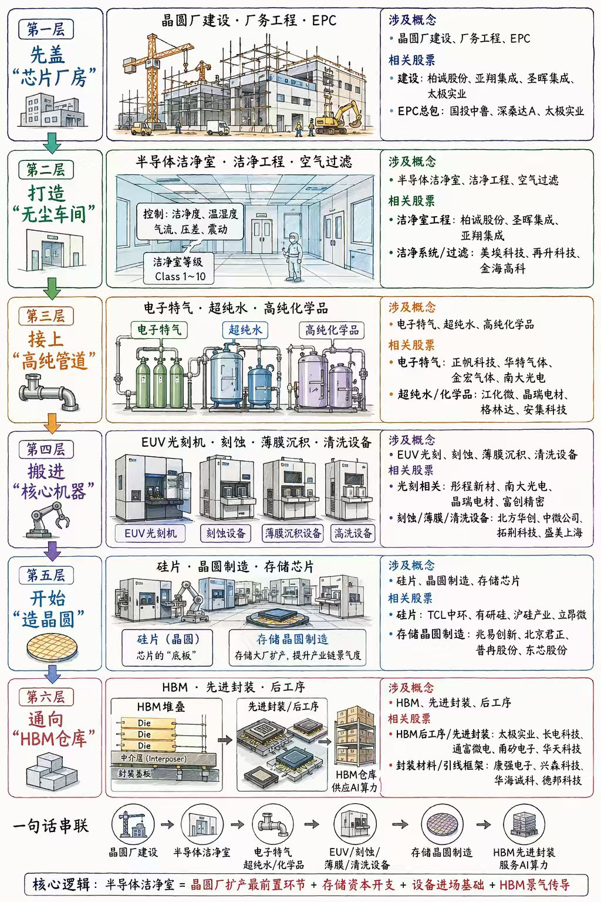

# 半导体厂务到HBM六层传导图解卡
> 所属模块：01_过程层 / 05_图表与配图
> 更新日期：2026-06-29
> 来源：用户提供图片，已转存为同目录素材图
> 使用边界：本卡用于沉淀图解结构、变量链和后续补证入口，不等于正式样本卡；图中“相关股票”默认视作传播口径，除非后续逐条核证，否则不直接上收为正式结论。

---

## 一句话结论

这张图真正有研究价值的地方，不是“又列了一批半导体概念股”，而是把 `晶圆厂扩产前置环节 -> 工艺环境与耗材 -> 核心设备进场 -> 存储/晶圆环节 -> HBM/先进封装` 串成了一条连续的资本开支传导链。

---

## 一、这张图在讲什么

图中把上游半导体与 AI 存储链拆成六层：

1. 第一层：先盖“芯片厂房”
   - 晶圆厂建设、厂务工程、EPC。
2. 第二层：打造“无尘车间”
   - 半导体洁净室、洁净工程、空气过滤。
3. 第三层：接上“高纯管道”
   - 电子特气、超纯水、高纯化学品。
4. 第四层：搬进“核心机器”
   - EUV 光刻、刻蚀、薄膜沉积、清洗设备。
5. 第五层：开始“造晶圆”
   - 硅片、晶圆制造、存储芯片。
6. 第六层：通向“HBM仓库”
   - HBM、先进封装、后工序。

图底部给出的核心逻辑是：

`半导体洁净室 = 晶圆厂扩产最前置环节 + 存储资本开支 + 设备进场基础 + HBM景气传导`

---

## 二、按本仓库方法拆解

### 1. 事实层

1. 这不是一张通用 AI 全景图，而是一张偏 `半导体制造前段到存储/封装后段` 的传导图。
2. 图的重点不在软件、IDC 运营或应用，而在 `制造侧 CapEx 链条`。
3. 它把“先有厂房和洁净环境，后有设备和工艺，再有晶圆与 HBM 兑现”这条顺序画得比较直观。

### 2. 变量层

这张图隐含的第一变量主要有四个：

1. `晶圆厂 / 存储厂扩产节奏`
2. `洁净室与厂务建设节奏`
3. `设备进场与安装调试节奏`
4. `HBM / 存储需求是否继续把上游 CapEx 逻辑往前传导`

### 3. 传导层

更适合用下面这条链理解：

`存储与先进封装需求预期抬升 -> 晶圆厂/封装厂启动扩产 -> 厂务/洁净室/高纯介质先行 -> 设备进场 -> 晶圆/存储/封装产能释放 -> HBM与先进封装景气兑现或证伪`

### 4. 验证层

如果后续要把这条线升级成正式研究，优先验证：

1. 厂务/洁净室公司：新增订单、在手订单、项目交付节奏、回款质量。
2. 电子特气/超纯水/湿电子化学品：客户导入、认证进度、产能利用率。
3. 设备公司：订单、合同负债、验收、收入确认与 OCF。
4. 存储/封装公司：ASP、毛利率、资本开支、在建工程、库存与客户结构。

### 5. 映射层

按当前仓库坐标，这张图主要落在结果层全景图的三个节点：

1. `1.3 晶圆制造与工艺`
2. `1.4 存储链`
3. `1.5 先进封装链`

对应参考主文：
[AI产业链全景图正式版.md](</F:/股票/ai-industry-cycle-research/03_结果层/01_总表整合与AI映射/AI产业链全景图正式版.md>)

---

## 三、图片中可直接提取的清晰口径

以下内容仅做图片摘录，不代表仓库已完成正式核证。

### 1. 较清晰的概念层口径

1. 第一层：晶圆厂建设、厂务工程、EPC。
2. 第二层：半导体洁净室、洁净工程、空气过滤。
3. 第三层：电子特气、超纯水、高纯化学品。
4. 第四层：EUV 光刻、刻蚀、薄膜沉积、清洗设备。
5. 第五层：硅片、晶圆制造、存储芯片。
6. 第六层：HBM、先进封装、后工序。

### 2. 较清晰的个股口径摘录

1. 第一层建设侧可读名单包括：`柏诚股份、亚翔集成、圣晖集成、太极实业`；EPC 总包名单建议后续 OCR 逐字复核后再固化。
2. 第二层洁净室 / 过滤侧可读名单包括：`柏诚股份、圣晖集成、亚翔集成、美埃科技、再升科技、金海高科`。
3. 第三层电子特气 / 化学品侧可读名单包括：`正帆科技、华特气体、金宏气体、南大光电、江化微、晶瑞电材、格林达、安集科技`。
4. 第四层设备侧可读名单包括：`彤程新材、南大光电、晶瑞电材、容大感光、北方华创、中微公司、拓荆科技、盛美上海`。
5. 第五层硅片 / 存储侧可读名单包括：`TCL中环、有研硅、沪硅产业、立昂微、兆易创新、北京君正、普冉股份、东芯股份`。
6. 第六层 HBM / 封装侧可读名单包括：`太极实业、长电科技、通富微电、甬矽电子、华天科技、康强电子、兴森科技、华海诚科、德邦科技`。

---

## 四、这张图最容易误用的地方

### 1. 不要把“图里有名字”直接当成“正式产业定位”

1. 图片更像传播型图解，不是经过逐家公司口径校验后的正式产业树。
2. 特别是第五层里部分公司，更接近 `存储设计 / 控制器 / 模组映射`，不等于严格意义上的“存储晶圆制造”。

### 2. 不要把“晶圆厂建设”与“AIDC机房建设”混成一条线

1. 这张图讲的是 `半导体制造 CapEx`。
2. 本仓库另有一条 `数据中心 / 供配电 / 液冷 / AIDC` 链，二者相关，但不是同一条利润链。

### 3. 不要把“HBM景气传导”写成“六层同步兑现”

1. 前置环节更早交易订单与建设。
2. 中段更早交易设备进场和认证。
3. 后段才看真正的晶圆、存储、封装利润兑现。
4. 顺序不同，审计口径也不同。

---

## 五、建议的后续升级方向

如果后续要把这张图继续做深，优先顺序建议是：

1. 先做一张 `六层对应仓库坐标表`，把每层准确挂到 `晶圆制造与工艺 / 存储链 / 先进封装链`。
2. 再做一张 `六层公司口径核验表`，把图片传播口径和公司正式披露拆开。
3. 再决定是否从中升级出正式观察组，例如：
   - `厂务洁净室组`
   - `电子特气与湿电子化学品组`
   - `存储扩产传导组`
4. 若不做正式组，至少也可以作为后续半导体上游专题的配图底稿。

---

## 六、当前结论口径

本图可作为仓库里的 `半导体制造前段 -> 存储/先进封装后段` 图解底稿保留；当前最有价值的不是股名单，而是它提示我们：AI 与 HBM 景气并不只在后段封装交易，很多时候会先以前置厂务、洁净室、高纯介质和设备进场的形式被市场提前交易。
