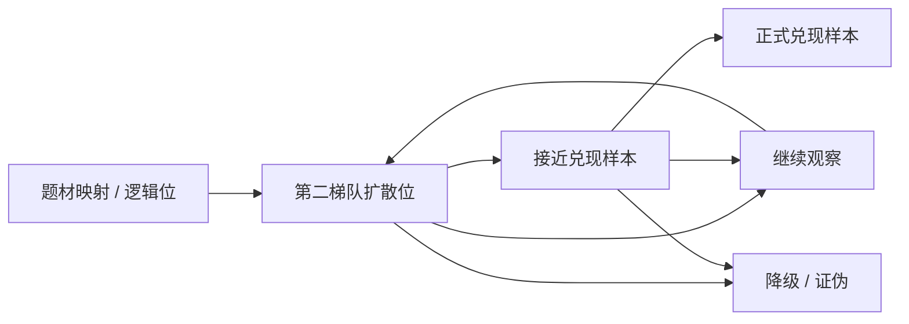

# AI上游第二梯队滚动评分表

> 所属模块：02_桥接层/02_AI产业链研究卡
> 研究时间窗：`2026-03-28 -> 2026-06-28`
> 生成日期：`2026-06-28`
> 跟踪对象：`华海诚科`、`有研硅`、`金盘科技`，并辅助跟踪 `科华数据`、`英维克`
> 研究定位：在 `AI上游第二梯队扩散观察清单.md` 基础上，继续把第二梯队下沉为 `滚动评分表 + 三情景推演台账`，用于后续中报、投关、订单公告和业绩预告的持续回填。
> 使用边界：本文件不是一次性观点，而是后续每出现一条新披露都可以增量更新的台账。
> 评分目的：不是判断股价短期涨跌，而是判断样本在 `第二梯队扩散位 -> 兑现样本 / 继续观察 / 降级` 三种状态之间如何迁移。

---

## 一、一句话结论

当前 AI 上游第二梯队里，最该优先做滚动评分的仍然是：

1. `华海诚科`
2. `有研硅`
3. `金盘科技`

因为这三家公司最接近从：

`验证 / 订单已成立`

走向：

`收入 / 利润 / 现金流继续兑现`

的临界点。

如果后续只允许盯最重要的迁移方向：

1. `华海诚科` 盯是否从 `验证通过` 升级到 `订单和收入占比兑现`
2. `有研硅` 盯是否从 `参股平台升级` 传导到 `上市公司经营质量`
3. `金盘科技` 盯是否从 `订单强斜率` 走向 `收入和 OCF 闭环`

---

## 二、评分原则

### 1. 评分不是看故事，而是看迁移

每条线都要回答三个问题：

1. `事实有没有继续升级`
2. `升级有没有开始传导到报表`
3. `传导质量是不是健康`

### 2. 评分结构

每家公司用三层评分：

1. `事实升级分`
   - 看客户、订单、产能、出货、分部收入、交付进展
2. `报表传导分`
   - 看收入、利润、毛利率、现金流、回款
3. `风险审计分`
   - 看 OCF、应收、存货、合同负债、在建工程、费用率

默认总分区间：

1. `8-10分`
   - 接近从第二梯队升级为兑现样本
2. `5-7分`
   - 仍处第二梯队扩散位
3. `3-4分`
   - 逻辑未坏，但需要回到继续观察
4. `0-2分`
   - 基本进入降级或证伪状态

### 3. 回填规则

后续每看到一条新披露：

1. 先更新 `最新事实`
2. 再更新 `三项评分`
3. 最后更新 `情景判断`

---

## 三、总表

| 公司 | 当前阶段 | 事实升级分 | 报表传导分 | 风险审计分 | 当前总分 | 当前状态 | 下一披露窗口 |
|---|---|---:|---:|---:|---:|---|---|
| 华海诚科 | 验证通过后等待产业化爬坡 | 4 | 2 | 1 | 7 | 第二梯队扩散位上沿 | `2026H1 / 三季报 / 新投关` |
| 有研硅 | 12英寸验证升级但利润传导慢 | 4 | 1 | 1 | 6 | 第二梯队扩散位 | `2026H1 / 三季报 / 新投关` |
| 金盘科技 | 订单强斜率但收入和 OCF 滞后 | 4 | 2 | 0 | 6 | 第二梯队扩散位 | `2026H1 / 三季报 / 说明会` |
| 科华数据 | 平台确认位 | 3 | 2 | 1 | 6 | 平台确认 / 可转扩散 | `2026H1 / 三季报` |
| 英维克 | 收入确认修复观察位 | 2 | 1 | 1 | 4 | 继续观察 | `2026H1 / 三季报 / 新投关` |

说明：

1. 当前打分是基于最近三个月已落地的正式披露做的首版初始化。
2. 后续任何公司若出现新披露，都可以直接覆盖本表对应栏位。

---

## 四、华海诚科滚动台账

### 1. 当前阶段

`先进封装材料验证通过 -> 产业化爬坡 -> 等待收入占比和现金流兑现`

### 2. 评分拆解

| 项目 | 当前判断 | 分值 |
|---|---|---:|
| 事实升级 | `GMC、FC底填胶` 已通过客户验证，并与主流封装厂建立稳定合作 | 4 |
| 报表传导 | `2025年` 与 `2026Q1` 收入增长明显，但先进封装材料收入占比仍不清晰 | 2 |
| 风险审计 | `2026Q1` OCF 仍为负，扩张质量仍需审计 | 1 |
| 合计 | 当前处于第二梯队上沿 | 7 |

### 3. 下一披露窗口

1. `2026H1`
2. `2026Q3`
3. 新的投资者关系活动记录

### 4. 三情景推演

#### 乐观情景

1. 中报披露先进封装材料收入占比抬升；
2. 出现主流封测客户批量订单；
3. OCF 改善。

对应迁移：

`第二梯队扩散位 -> 接近兑现样本`

#### 中性情景

1. 继续确认已通过客户验证；
2. 收入继续增长；
3. 但订单规模和现金流没有实质升级。

对应迁移：

`维持第二梯队扩散位`

#### 悲观情景

1. 长期只有“已验证”表述；
2. 先进封装材料收入占比不抬升；
3. 现金流继续承压。

对应迁移：

`从第二梯队上沿降回继续观察`

### 5. 当前最重要一句话

> 华海诚科最关键的不是再证明“能做先进封装材料”，而是证明先进封装材料已经开始成为收入、订单和现金流的真实驱动项。

---

## 五、有研硅滚动台账

### 1. 当前阶段

`12英寸验证升级 -> 批量交付继续推进 -> 仍等待上市公司经营质量传导`

### 2. 评分拆解

| 项目 | 当前判断 | 分值 |
|---|---|---:|
| 事实升级 | `12英寸` 产能、出货、长江存储等客户认证均已写实 | 4 |
| 报表传导 | 上市公司利润和经营质量改善仍偏慢 | 1 |
| 风险审计 | 更大的不确定性来自参股平台收益传导路径 | 1 |
| 合计 | 当前仍是中确定性升级位 | 6 |

### 3. 下一披露窗口

1. `2026H1`
2. `2026Q3`
3. 新的投资者关系活动记录

### 4. 三情景推演

#### 乐观情景

1. 新增先进存储或逻辑客户认证；
2. 12 英寸放量继续；
3. 参股平台收益开始更清晰传导到上市公司。

对应迁移：

`第二梯队扩散位 -> 接近兑现样本`

#### 中性情景

1. 继续维持订单饱满、稼动率高位；
2. 客户认证缓慢推进；
3. 经营质量仍无明显跃迁。

对应迁移：

`维持第二梯队扩散位`

#### 悲观情景

1. 客户认证停滞；
2. 量增不增利；
3. 参股平台升级始终不能有效传导。

对应迁移：

`从扩散位退回长期逻辑位`

### 5. 当前最重要一句话

> 有研硅最大的分歧，不在12英寸逻辑真不真，而在12英寸升级能否真正从参股平台走到上市公司报表。

---

## 六、金盘科技滚动台账

### 1. 当前阶段

`订单强化 -> 收入利润滞后兑现 -> OCF 和备货审计提前出现`

### 2. 评分拆解

| 项目 | 当前判断 | 分值 |
|---|---|---:|
| 事实升级 | 数据中心订单、海外订单和在手订单斜率都很高 | 4 |
| 报表传导 | 收入与利润仍在兑现，但斜率明显弱于订单 | 2 |
| 风险审计 | `2026Q1` OCF 转负，存货和合同负债抬升 | 0 |
| 合计 | 当前是基础设施接力位中的高弹性样本 | 6 |

### 3. 下一披露窗口

1. `2026H1`
2. `2026Q3`
3. 业绩说明会 / 订单更新

### 4. 三情景推演

#### 乐观情景

1. 数据中心订单开始更明显转化为收入；
2. 海外交付继续顺畅；
3. OCF 修复。

对应迁移：

`第二梯队扩散位 -> 兑现样本`

#### 中性情景

1. 订单继续强，但收入确认只是小幅改善；
2. OCF 波动仍大；
3. 市场继续在“高弹性设备”和“高位设备审计”之间反复摇摆。

对应迁移：

`维持第二梯队扩散位`

#### 悲观情景

1. 订单强势无法转化为收入与回款；
2. OCF 继续恶化；
3. 存货与合同负债继续抬升。

对应迁移：

`从扩散位转向高位设备审计样本`

### 5. 当前最重要一句话

> 金盘科技后续真正决定能否升级的，不是订单有多快，而是订单能否闭环成收入、利润和现金流。

---

## 七、辅助观察位台账

## 1. 科华数据

### 当前阶段

`平台确认位 -> 等待分部收入与回款质量进一步坐实`

### 当前总分：`6`

### 当前最重要变量

1. 数据中心分部收入
2. 平台交付效率
3. 应收、库存、合同负债、OCF 匹配

### 三情景推演

1. 乐观：
   - 分部收入升级，应收和 OCF 改善同步出现
2. 中性：
   - 平台口径继续强化，但经营质量改善有限
3. 悲观：
   - 平台故事继续，报表和营运资本错配扩大

## 2. 英维克

### 当前阶段

`收入确认修复观察位`

### 当前总分：`4`

### 当前最重要变量

1. 发货确认
2. 回款节奏
3. 毛利率修复

### 三情景推演

1. 乐观：
   - 发货与收入确认明显改善，回款修复
2. 中性：
   - 订单充沛，但收入确认继续偏慢
3. 悲观：
   - 节奏继续拖延，市场下调液冷兑现质量预期

---

## 八、状态迁移图

当前五家公司所在位置：

1. `华海诚科`：`第二梯队扩散位上沿`
2. `有研硅`：`第二梯队扩散位`
3. `金盘科技`：`第二梯队扩散位`
4. `科华数据`：`平台确认 / 可转扩散`
5. `英维克`：`继续观察`

---

## 九、后续回填模板

后续每出现一条新披露，可直接按下面模板补：

| 日期 | 公司 | 新披露 | 事实升级变化 | 报表传导变化 | 风险审计变化 | 调整后总分 | 状态迁移 |
|---|---|---|---|---|---|---:|---|
| `待补` | `待补` | `待补` | `待补` | `待补` | `待补` | `待补` | `待补` |

---

## 十、可直接复用结论

> AI 上游第二梯队后续最值得做的，不是继续加名单，而是做滚动评分。当前华海诚科、有研硅、金盘科技都已不再是纯题材观察位，而是处在“验证和订单已成立、但报表还没完全吃透”的临界点：华海诚科要看先进封装材料收入占比、批量订单和现金流改善；有研硅要看 12 英寸升级能否真正传导到上市公司经营质量；金盘科技要看数据中心订单能否闭环成收入、利润和 OCF。谁能先把这一段链条补齐，谁就最有可能从第二梯队升级为正式兑现样本。

---

## 十一、配套文件入口

1. [AI产业链上游研究_近三个月跟踪.md](</F:/股票/ai-industry-cycle-research/02_桥接层/02_AI产业链研究卡/AI产业链上游研究_近三个月跟踪.md>)
2. [AI上游谁最接近下一轮预期差扩散.md](</F:/股票/ai-industry-cycle-research/02_桥接层/02_AI产业链研究卡/AI上游谁最接近下一轮预期差扩散.md>)
3. [AI上游第二梯队扩散观察清单.md](</F:/股票/ai-industry-cycle-research/02_桥接层/02_AI产业链研究卡/AI上游第二梯队扩散观察清单.md>)
4. [华海诚科_先进封装材料预期差卡.md](</F:/股票/ai-industry-cycle-research/02_桥接层/03_AI标杆股研究卡/华海诚科_先进封装材料预期差卡.md>)
5. [有研硅_300mm硅片预期差卡.md](</F:/股票/ai-industry-cycle-research/02_桥接层/03_AI标杆股研究卡/有研硅_300mm硅片预期差卡.md>)
6. [金盘科技_AI标杆股K线图谱卡.md](</F:/股票/ai-industry-cycle-research/02_桥接层/03_AI标杆股研究卡/算力设备组/金盘科技_AI标杆股K线图谱卡.md>)
7. [科华数据_AI标杆股K线图谱卡.md](</F:/股票/ai-industry-cycle-research/02_桥接层/03_AI标杆股研究卡/算力设备组/科华数据_AI标杆股K线图谱卡.md>)
8. [英维克_AI标杆股K线图谱卡.md](</F:/股票/ai-industry-cycle-research/02_桥接层/03_AI标杆股研究卡/服务器_温控组/英维克_AI标杆股K线图谱卡.md>)
